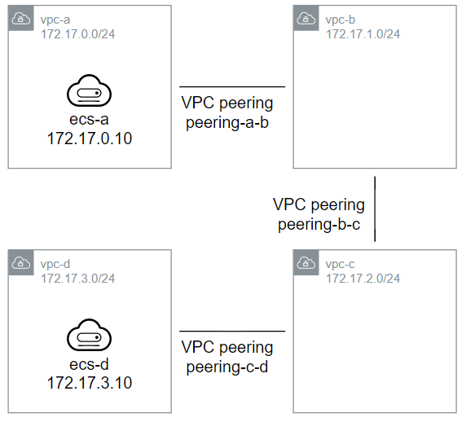
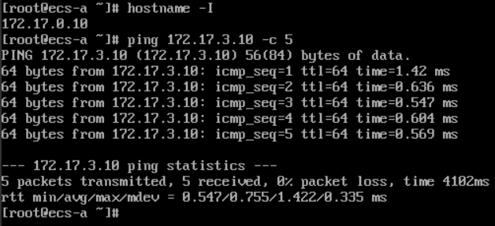
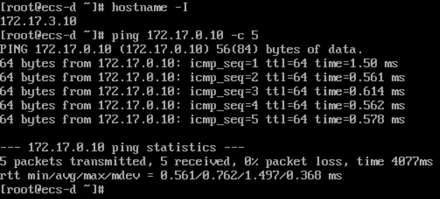

# Huawei Cloud multi-peering demonstration

This Terraform code aims to demonstrate how to use VPC peerings to establish
connection between multiple VPCs in a "daisy chain" architecture.

## Instructions

1. Install Terraform: <https://developer.hashicorp.com/terraform/downloads>
2. Get an AK and SK for your Huawei Cloud account: <https://support.huaweicloud.com/intl/en-us/usermanual-ca/ca_01_0003.html>
3. Clone this repository or download as ZIP and decompress it
4. Make a copy of `terraform.tfvars.example` named `terraform.tfvars` and set
   `hwcloud_ak` and `hwcloud_sk` obtained in step 2, and `hwcloud_region` with
   the region code: <https://developer.huaweicloud.com/intl/en-us/endpoint>
5. Run `terraform init` to download the provider (needs to be done only once)
6. Run `terraform apply`, check the plan, and then confirm
7. In the Cloud Console, do a Remote Login on `ecs-a` (user `root`, password
   `PeeringTest#123`) and ping `ecs-d` address (`172.17.3.10`)
8. Do a Remote Login on `ecs-d` (same user and password) and ping `ecs-a`
   address (`172.17.0.10`)
9. After tests are finished, run `terraform destroy` to delete the test
   resources.

## Results

Ping result from `ecs-a` to `ecs-d`:

Ping result from `ecs-d` to `ecs-a`:

